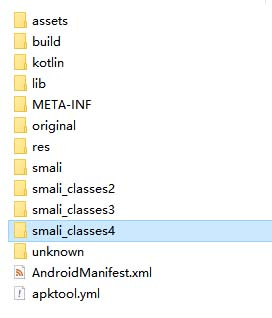

## please translate by yourself
悬浮窗生效范围：没有任何保护的app </br>
自动查找生效前提：官方没有修改il2cpp相关的结构体 && il2cpp导出函数没有被隐藏 </br>


* 编译源码，生成 `app-release.apk`
    * 下载源码，使用android studio打开
    * 如果是局域网用户（CN），修改根目录下的build.gradle， 将CN version下面的注释取消掉，这样就可以使用阿里云镜像下载对应依赖库了
    * Generate Signed Bundle --> APK
* 反编译`app-release.apk`，得到`app-release`文件夹
* 反编译`games.apk`，得到`games`文件夹
* 将`app-release`的smali文件夹下的文件，拷贝到`games`文件夹下的smali目录里面（如果有多个smali目录，放在最后一个） </br>
    
* 将`app-release`文件夹的so文件`libHI3.so`改名为`libHI3`（Main.java决定），并拷贝到`games`文件夹下的assets目录里面
* 修改 `games` 的 AndroidManifest.xml，并保存
    * `<application android:appComponentFactory="androidx.core.app.CoreComponentFactory" ... android:name="com.combosdk.openapi.ComboApplication" ...>`  `application`里面的这个`android:name`指向我们要修改的`smali`路径
    * 在`</application>`这个标签，在它前后添加代码，如下：
    ```
    <service android:name="com.android.support.Launcher" android:enabled="true" android:exported="false" android:stopWithTask="true"/>
    </application>
    <uses-permission android:name="android.permission.SYSTEM_ALERT_WINDOW"/>
    ```
    
* 根据上条，打开`games`的smali目录, 编辑`android:name`指向的`smali`，找到`constructor <init>()V`这个方法（一般是第一个方法），在`.locals`的下一行插入代码
    ```
    invoke-static {}, Lcom/android/support/Main;->Start()V
    ``` 
* 将`games`重新编译成mod apk

## 注意
* 某些游戏可能存在游戏保护，当它发现游戏被篡改时，会第一时间杀掉游戏进程，导致游戏闪退。
    * 使用本项目导致游戏闪退，可能是存在游戏保护，自行搞定
    * 如何绕过游戏保护，这属于安全攻防问题，我不能透露，不然本项目里菜单apk可能就难产了

