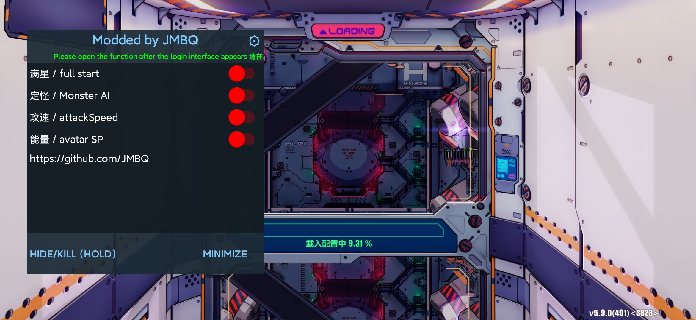
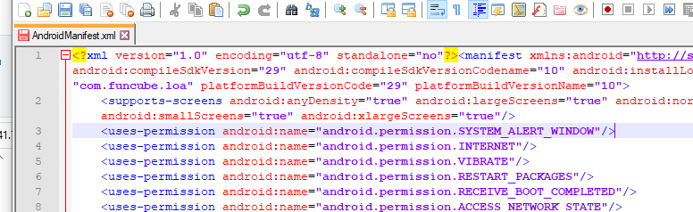
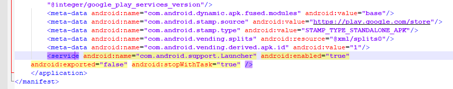
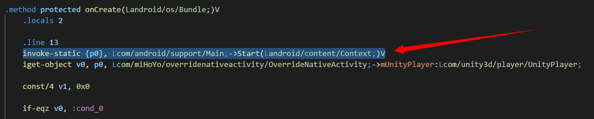
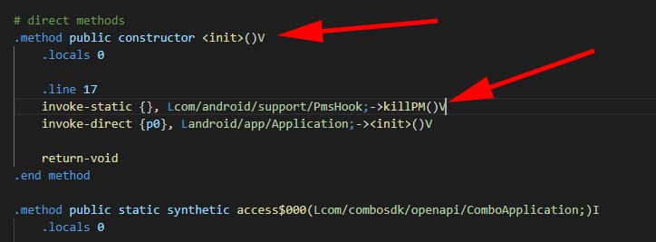
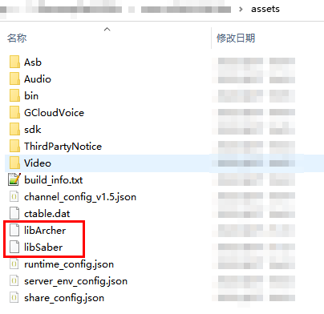

# Honkai Impact 3 mod

针对 崩坏3rd 的悬浮菜单mod
<br></br>

02/15/2023  
自1.2.0起，不再支持armeabi-v7a架构、安卓模拟器   
更新项目源码，添加了过普通签名校验 
  
   
## 特点
* 目前只适用于国外区服（sea, global, JP, KR, TW）, 国服玩家看页尾
* 适配安卓手机arm64-v8a架构
* 没有广告
  
## 模拟器 (Releases 1.1.0)
* 在某些模拟器上会出现闪退，指向libhoudini.so，无法彻底修复
  * 夜神模拟器(nox7)，推荐度100%，完美运行
  * 雷电模拟器9，推荐度50%，概率抽风闪退
  * mumu，推荐度0%
  * 其它未测试
  
## 食用
  video文件夹有PC + android 视频教程

* 反编译游戏apk，生成对应文件夹
<br></br>
<br></br>
* 添加悬浮窗权限
```
<uses-permission android:name="android.permission.SYSTEM_ALERT_WINDOW"/>
```
<br></br>
<br></br>
<br></br>
* 添加悬浮窗服务	
```
<service android:name="com.android.support.Launcher" android:enabled="true" android:exported="false" android:stopWithTask="true"/>
```
<br></br>
<br></br>
<br></br>
* 拷贝smali_classes4文件夹到游戏文件夹里面
<br></br>
<br></br>
<br></br>
* 打开com\miHoYo\overridenativeactivity\OverrideNativeActivity.smali，找到onCreate方法，在方法开头插入
```
invoke-static {p0}, Lcom/android/support/Main;->Start(Landroid/content/Context;)V
```
<br></br>
<br></br>
<br></br>
* 打开com\combosdk\openapi\ComboApplication.smali，找到init方法，在方法开头插入
```
invoke-static {}, Lcom/android/support/PmsHook;->killPM()V
```
<br></br>  
<br></br>
<br></br>
* 将libSaber文件放入游戏目录assets文件夹内
<br></br>
* 编译游戏文件夹，生成直装包


## 注意
* 首次运行游戏，在正常情况下会跳至悬浮权限界面
* 刚打开游戏就闪退
  * 偶尔出现刚打开就闪退 属于正常现象
  * 连续多次出现刚打开就闪退 属于不正常现象，检查是否存在错误操作

## 最后
* 该mod不适合国服(有多重签名校验)
* 如果你手机已解锁，可以使用 [U.R.C](https://github.com/JMBQ/URC)，通杀所有区服
* 已提供简中服6.5版本直装破解包
