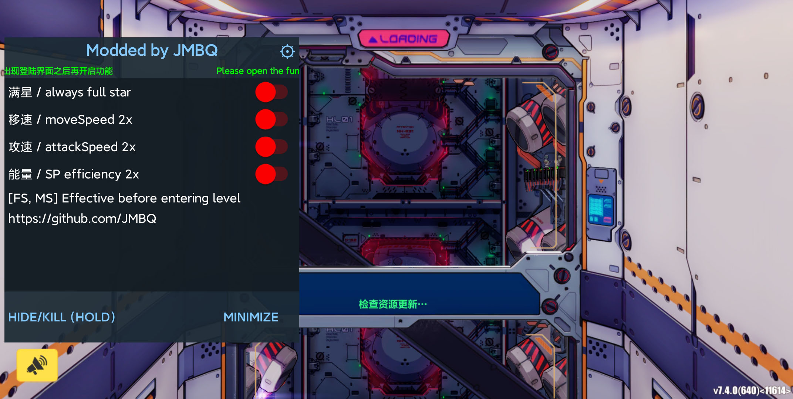

# Honkai Impact 3 mod

## English version click [here](README_EN.md)
<br></br>


   
## 特点
* 适配国外区服, 包括且不限sea, global, jp, kr, tw, vn
* 适配安卓64位手机, 无需root
* 适配arm64-v8a架构 (64位)
* 支持绕过普通签名校验
* 没有广告
* 国服玩家看页尾
  
## 模拟器
* 不再支持32位模拟器
  * 64位夜神模拟器9 (nox9), 推荐度100%
  * 64位雷电模拟器9, 推荐度50%, 概率抽风
  * mumu，推荐度0%
  * 其它未测试
  
## 食用
* Release附带教程，自行食用即可

* 反编译游戏apk，生成对应文件夹
<br></br>
<br></br>
* 修改AndroidManifest.xml
  * 添加悬浮窗权限, 添加悬浮窗服务
  ```
  <service android:name="com.android.support.Launcher" android:enabled="true" android:exported="false" android:stopWithTask="true"/>

  <uses-permission android:name="android.permission.SYSTEM_ALERT_WINDOW"/>
  ```
  
  <br></br>

  * 修改启动android:name
  <br></br>
  将 ```com.combosdk.openapi.ComboApplication``` 替换成 ```com.android.support.PmsHook```
  <br></br>
  ```
  <application ... android:name="com.combosdk.openapi.ComboApplication" ...>
  ```
  ```
  <application ... android:name="com.android.support.PmsHook" ...>
  ```
  
  <br></br>
* 拷贝smali_classes4文件夹 和 assets文件夹 到游戏文件夹里面
<br></br>
<br></br>
<br></br>
* 编译游戏文件夹，生成直装包


## 注意
* 首次运行游戏，在正常情况下会跳至悬浮权限界面
* 刚打开游戏就闪退
  * 偶尔出现刚打开就闪退 属于正常现象
  * 连续多次出现刚打开就闪退 属于不正常现象，检查是否存在错误操作

## 最后
* 该mod不适合国服(有多重签名校验)
* 如果你手机已解锁bootloader，可以使用 [U.R.C](https://github.com/JMBQ/URC)，适用所有区服
* 已提供简中服6.5版本直装破解包
