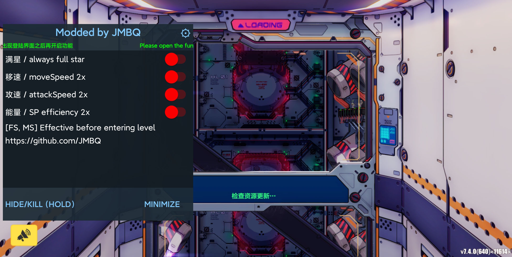
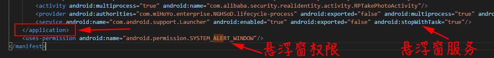
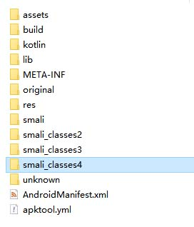

# Honkai Impact 3 mod

<br></br>


   
## Features
* Available for this servers, including sea, global, jp, kr, tw, vn
* Android 64-bit phones, no root required
* Compatible with arm64-v8a architecture (64-bit)
* Support for bypassing normal signature checks
* No advertising
  
## x86 Android Emulator
* 32-bit emulators are no longer supported
  * nox9 (64-bit), Recommendation 100%
  * ldplayer9 (64-bit), Recommendation50%
  * Other emulators not tested
  
## How to use
* Release comes with a tutorial

* Decompile the game apk and generate the corresponding folder
<br></br>
<br></br>
* modify AndroidManifest.xml
  * Add SYSTEM_ALERT_WINDOW permissions, Add corresponding service
  ```
  <service android:name="com.android.support.Launcher" android:enabled="true" android:exported="false" android:stopWithTask="true"/>

  <uses-permission android:name="android.permission.SYSTEM_ALERT_WINDOW"/>
  ```
  
  <br></br>

  * modify android:name
  <br></br>
  Replace ```com.combosdk.openapi.ComboApplication``` with ```com.android.support.PmsHook```
  ```
  <application ... android:name="com.combosdk.openapi.ComboApplication" ...>
  ```
  ```
  <application ... android:name="com.android.support.PmsHook" ...>
  ```
  
  <br></br>
* Copy the smali_classes4 folder and the assets folder into the game folder
<br></br>
<br></br>
<br></br>
* Compile the game folder to generate a direct install package


## Cautions
* The first time you run the game, you will jump to the hover permission screen under normal circumstances
* Crash just after opening the game
  * Occasional crashes just after opening are normal
  * Crash just after opening several times in a row This is not normal, check for incorrect operation

## Finally
* If your phone is unlocked for bootloader, you can use [U.R.C](https://github.com/JMBQ/URC) for all servers
